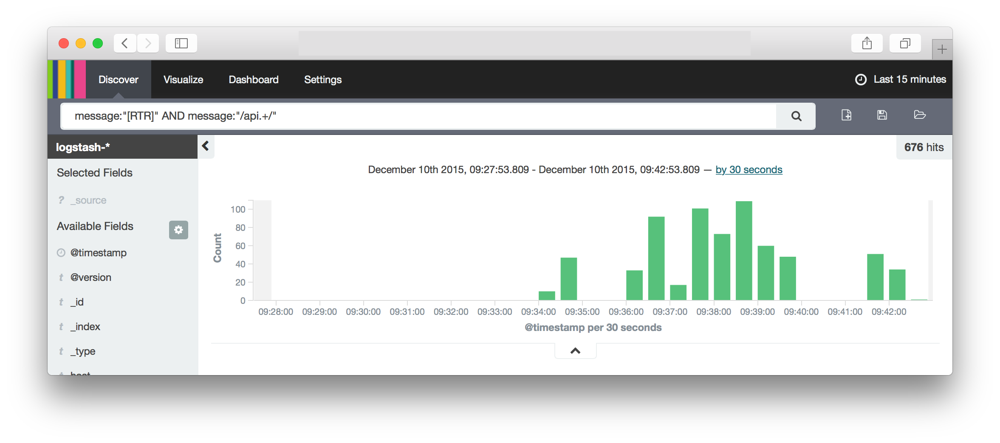

# Analytics

## Introducing the ELK Stack

The Open Opportunities Platform uses the ELK stack to provide real-time data
analytics and dashboards. To read more on the ELK stack and it's three
components, please see the three items below:

* [Elasticsearch](https://www.elastic.co/products/elasticsearch)
* [Logstash](https://www.elastic.co/products/logstash)
* [Kibana](https://www.elastic.co/products/kibana)

### Kibana Discover Dashboard



### Accessing the Kibana dashboard

Following best practices, our Kibana dashboard is secured behind an Nginx proxy
server. Because of this to use Kibana you will have to authenticate using a
login and password. This information along with the URI can be found in the
Cloud Foundry Kibana Proxy application's environment variables. If you have
access to Cloud Foundry, the following command should provide your with the
credentials for the Kibana proxy

```
❯❯❯❯❯❯❯ cf env <KIBANA_PROXY_APP_NAME>
```

Look under `User-Provided` for a hash of `credentials`. Make sure that you are
targeting the correct `organization` and `space` when running the above command.
To retrieve the name of the application you can run `cf apps` which should
display the Kibana proxy application.
