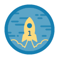
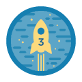
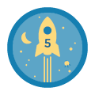
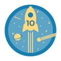
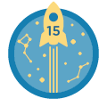
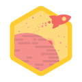
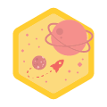
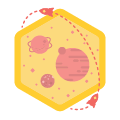
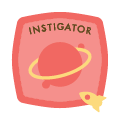
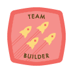

# Badges

Badges are awarded for specific tasks completed or created.  They appear on the logged in home page and on the user's profile.

## Number of Tasks

###  Newcomer
First task completed by user

### Maker
3rd task completed by user

### Game Changer
5th task completed by user

### Disruptor
10th task completed by user

### Partner
15th task completed by user

## Agency Tasks

###  Local
Completed 2 tasks for one agency

###  Explorer
Completed Tasks for 2nd agency

### Connector
Completed Tasks for 3rd agency

## Task Creation

###  Instigator
Create first one-time task

###  Mentor
Created first ongoing task

###  Team Builder
Accepted 4 or more people on a task

